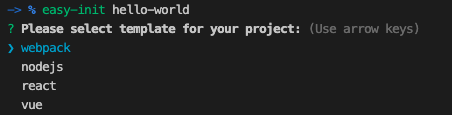

easy-init
=========

create nodejs/vanilla js/react/vue project with eslint and webpack default configured.

# install #

```bash
$ npm install easy-init -g
$ yarn global add easy-init
```

# initialize your project #

```bash
# create new project and directory
$ easy-init `your-project-directory-name`

# create new project in existing directory
$ cd your-project-directory
$ easy-init
```

# Snapshot # 
